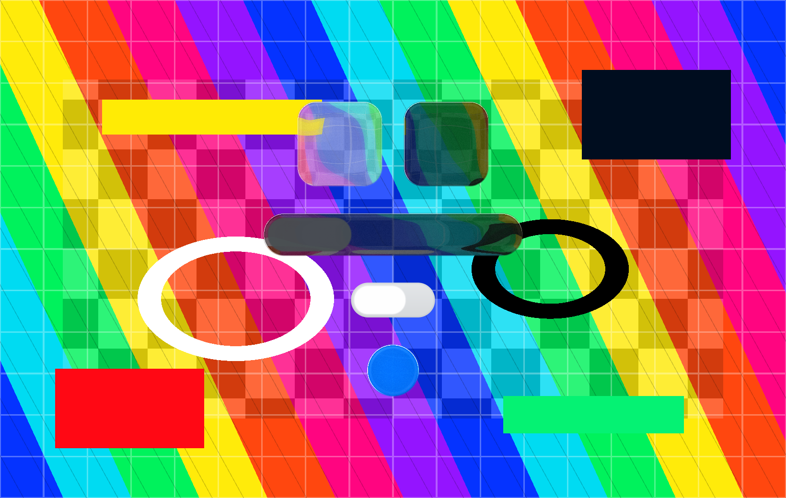

# MeltedUIFramework

MeltedUIFramework is a small C/OpenGL UI layer built on top of the separate
[`MeltedGlassOpenGL`](https://github.com/ExoCore-Kernel/MeltedGlassOpenGL)
library. It keeps the glass renderer as an external dependency at
`external/MeltedGlassOpenGL`, so the UI layer can move forward whenever the
glass layer updates.

The current controls are `MeltedUIWidget`, `MeltedUIMenu`, `MeltedUISwitch`,
and `MeltedUIButton`.



`MeltedUIWidget` renders a substrate-only rounded widget panel with the normal
MeltedGlassOpenGL shader. It has light and dark themes tuned for
calendar/weather-style widgets, but it does not draw labels, icons, or text
overlays; callers can layer their own content on top.

`MeltedUIMenu` renders a pill-shaped menu with a normal MeltedGlassOpenGL shader
background. Its selected item is a separate draggable prismatic shader panel, so
changing selection gives a liquid segmented-control feel. The menu supports
light and dark themes plus a configurable item count.

`MeltedUISwitch` uses a flat rounded OpenGL track while the switch knob is
rendered with `melted_glass_draw_button_panel`. Holding the knob activates the
liquid effect:

1. the knob press amount rises, so the existing button shader grows and turns liquid;
2. the knob follows the pointer while the shader effect is active;
3. releasing drops the press amount, so the shader shrinks it back into place.

`MeltedUIButton` renders a 95% opaque blue circular button with the normal
MeltedGlassOpenGL shader, including the shader's rim, fresnel, specular, bevel,
and top highlight passes. Pressing the button animates `pressAmount`, grows the
shader rect, and smoothly tints it toward a slightly lighter blue; releasing
eases it back to its resting size and color.

## Dependency Layout

Clone the framework with its glass dependency:

```bash
git clone --recurse-submodules https://github.com/ExoCore-Kernel/MeltedUIFramework.git
cd MeltedUIFramework
```

If you already cloned it, initialize the dependency with:

```bash
git submodule update --init --remote external/MeltedGlassOpenGL
```

The Makefile defaults to `external/MeltedGlassOpenGL`. It also supports sibling
checkouts at `../MeltedGlassOpenGL` or `../LiquidGlassOpenGL`, and you can always
override it:

```bash
make MELTED_GLASS_DIR=/path/to/MeltedGlassOpenGL
```

## Build

```bash
make
```

The build outputs are:

```text
build/libmelted_ui.a
build/melted_ui_switch_demo
```

## Interactive Demo

```bash
make run
```

Controls:

- click menu items or drag the selected menu slider to change selection
- the two rounded widgets are light/dark substrate examples with no text overlays
- press T to toggle light/dark menu theme
- press [ or ] to change the menu item count
- click the blue button to grow it
- click the switch to toggle it flat
- drag the knob to scrub it with liquid growth
- press Space to toggle
- press R to reset off
- press Esc or Q to quit

Generate the README control screenshot from the demo:

```bash
make screenshot
```

## Library Usage

Your app should already have an OpenGL 3.2+ context and a `MeltedGlassRenderer`.
For best refraction, render your normal scene plus the switch track into a scene
framebuffer, blur that framebuffer with MeltedGlassOpenGL, copy the scene to the
final framebuffer, then draw the switch knob.

```c
MeltedUIRenderer ui;
melted_ui_renderer_init(&ui);

MeltedUIWidget widget;
melted_ui_widget_defaults(&widget, 48.0f, 48.0f, 280.0f, 280.0f, MELTED_UI_WIDGET_DARK);

MeltedUIMenu menu;
melted_ui_menu_defaults(&menu, 72.0f, 48.0f, 420.0f, 78.0f, 3, MELTED_UI_MENU_DARK);

MeltedUISwitch control;
melted_ui_switch_defaults(&control, 120.0f, 80.0f, 156.0f, 64.0f);

MeltedUIButton button;
melted_ui_button_defaults(&button, 148.0f, 172.0f, 88.0f, 88.0f);

/* Each frame. */
melted_ui_widget_set_theme(&widget, MELTED_UI_WIDGET_DARK);
melted_ui_menu_update(&menu, dt);
melted_ui_switch_update(&control, dt);
melted_ui_button_update(&button, dt);

/* Draw into the scene texture before blurring so the knob refracts the track. */
glBindFramebuffer(GL_FRAMEBUFFER, sceneFbo);
melted_ui_draw_switch_track(&ui, &control, width, height);

GLuint blurredTexture = melted_glass_blur_background(&glass, &glassCfg, sceneTexture);

/* Draw final scene, then draw the liquid controls. */
glBindFramebuffer(GL_FRAMEBUFFER, finalFbo);
melted_glass_set_premultiplied_blend();
melted_ui_draw_widget(&widget, &glass, &glassCfg,
                      sceneTexture, blurredTexture, width, height);
melted_ui_draw_menu(&menu, &glass, &glassCfg,
                    sceneTexture, blurredTexture, width, height);
melted_ui_draw_switch_knob(&control, &glass, &glassCfg,
                           sceneTexture, blurredTexture, width, height);
melted_ui_draw_button(&button, &glass, &glassCfg,
                      sceneTexture, blurredTexture, width, height);
```

For simpler rendering where the knob does not need to refract the track under it,
call `melted_ui_draw_switch(...)` in one pass.
